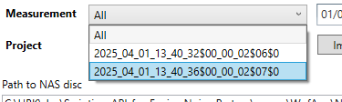

# Scripting-API-for-Enviro-Noise-Partner

This repository contains a scripting API that can remote control Enviro Noise Partner. The API makes it possible to:
- launch or attach to a running instance of Enviro Noise Partner
- shutdown Enviro Noise Partner
- open, close or save Enviro Noise Partner (.enp) projects
- import measurements from an 2245 or 2255 instrument. Either a specific measurement or all measurements from a specified date can be imported.
- import projects from an 2245 or 2255 instrument.
- import measurements from NAS disc. Either a specific measurement or all measurements from a specified date can be imported.
- import projects from NAS disc.
- export projects to Excel or text files (CSV format)
- create reports from projects
- manipulate the user interface (change language, tabs, expand property panel or items in this)

The repository also contains an example WPF program demonstrating these features.

When specifying an instrument IP or a NAS URL the program will automatically prepare to import the latest project or measurements. It is also possible to specify a specific named project or chose a specific measurement from a drop down:

